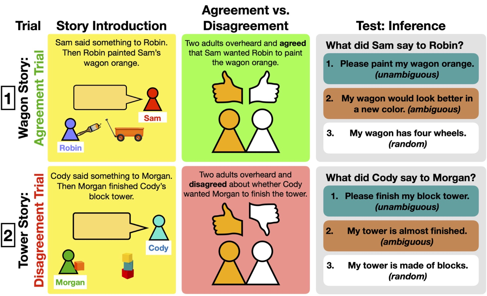

# Children use disagreement to infer what happened

This repository contains the study materials, data, analyses, and figures for the paper "[Children use disagreement to infer what happened](https://osf.io/preprints/psyarxiv/y79sd)" by Jamie Amemiya, Gail D. Heyman, and Tobias Gerstenberg .



__Contents__:
- [Introduction](#introduction)
- [Preregistration](#preregistration)
- [Experiments](#experiments)

## Introduction
A challenge when figuring out what happened based on what others say is that they might disagree. Two preregistered experiments examined how children age 7 to 11 years use disagreement to make inferences about social events. Specifically, when there is no reason to question the reliability of either informant, can children use disagreement to infer that an ambiguous social event occurred? Experiment 1 *N* = 52 found that children are indeed more likely to infer that an ambiguous social event occurred after learning that people disagreed (versus agreed) about what happened and that these inferences become stronger with age. Experiment 2 *N* = 110 examined children's ability to *predict* that an ambiguous social event would cause disagreement and applied a computational model to examine the extent to which predictions explained their inferences. Children made the expected predictions and their inferences were consistent with the computational model, indicating that the ability to predict disagreement plays an important role for drawing inferences about what happened.

## Preregistrations
Both experiments were preregistered via the Open Science Framework, [Experiment 1](https://osf.io/jbkvm/?view_only=0d6ba84ba3dd42c5909dc8da0cc5d483) and [Experiment 2](https://osf.io/7ha68/?view_only=af2061b1df3941dd83bae87d64d97f14).

## Repo structure

```
.
├── analysis
├── data
├── docs
├── figures
│   ├── diagrams
│   └── plots
├── materials
└── videos
```

### analysis

- RMarkdown file with stats and plots 
- You can view the rendered analysis file [here](https://cicl-stanford.github.io/children_disagree/)

### data

- csv files for all experiments 

### figures

- plots and diagrams from the paper 

### materials

- document with all the different story versions 
- slides used for running both experiments 

### videos

- sample versions of the procedure from each experiments: 
	+ Experiment 1 - [Inference](videos/exp1_inference_story_version_1.mp4)
	+ Experiment 2 - [Prediction](videos/exp2_prediction_story_version_1.mp4)
	+ Experiment 2 - [Inference](videos/exp2_inference_story_version_1.mp4)
